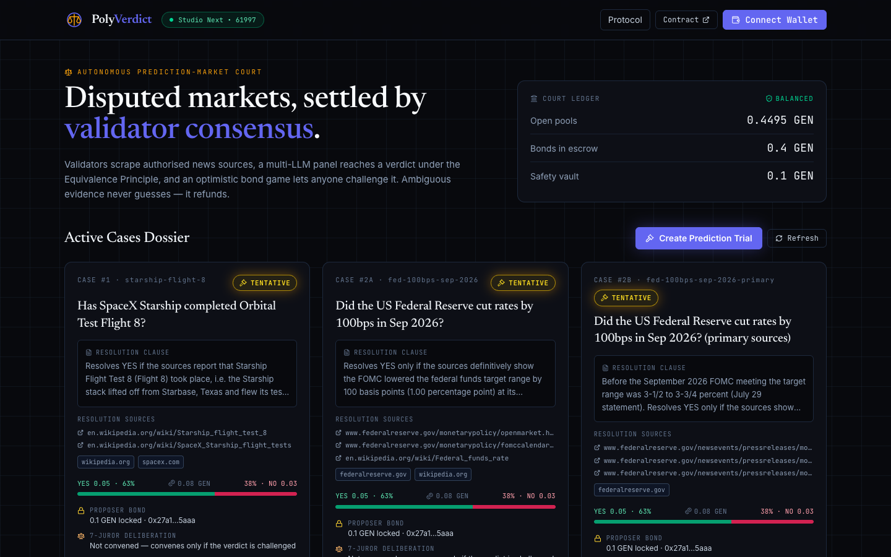
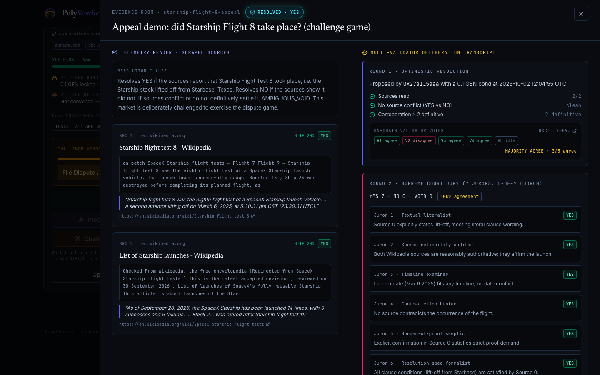

# PolyVerdict — Autonomous Prediction-Market Resolution & Dispute Court

Prediction markets break down at the moment they matter most: a subjective clause, two outlets reporting
different facts, or a centralized oracle that answers late (or not at all). **PolyVerdict** replaces the
oracle with a court that lives on [GenLayer](https://genlayer.com):

1. **Validators scrape** the news sources a market authorised (Reuters, AP, official gazettes, central-bank
   pages…) — and nothing else.
2. Each validator's **LLM takes a stance per source** (`YES` / `NO` / `UNCLEAR`, with a verbatim quote). The
   contract derives the verdict **deterministically** from those stances, so validators agree under GenLayer's
   Equivalence Principle even though their wording differs.
3. Conflicting or inconclusive evidence **never guesses**: it resolves to `AMBIGUOUS_VOID` and every bettor pulls a
   100 % principal refund.
4. An **optimistic bond game** lets anyone contest a verdict inside a 24 h window; a 7-juror panel decides and the
   loser's bond is slashed.

- Network: **GenLayer Studio Next**, chain id `61997` (`0xF22D`)
- RPC: `https://studio-next.genlayer.com/api` · Explorer: <https://explorer-studio-next.genlayer.com>
- Author: SOBEK96 <btcehsan@yahoo.com>

```
contracts/poly_verdict.py   GenVM contract (≈1000 lines)
tests/                      313 direct-mode pytest tests (in-memory GenVM, no network)
scripts/                    deploy.py · interact_live.py · render_readme.py
deployments/studio-next.json  address, bytecode SHA-256, every live tx + validator votes
frontend/                   Vite + React + Tailwind + lucide + viem/genlayer-js "Truth Court" HUD
```

---

## 1. Live deployment (Studio Next)

<!-- CONTRACT:START -->
| Field | Value |
|---|---|
| Network | GenLayer Studio Next, chain id `61997` (`0xF22D`) |
| RPC | `https://studio-next.genlayer.com/api` |
| Contract | [`0xd4D11029d4DA195dCc3342cF4D677c6B1A16E64C`](https://explorer-studio-next.genlayer.com/address/0xd4D11029d4DA195dCc3342cF4D677c6B1A16E64C) |
| Deployer / governor | `0x27a1Ebe0C137F74D3fbdeF8796B3B5Ad7af45aaa` |
| Bytecode SHA-256 | `cda324d94496a4f1abf5d2862476e30495db95c34c42b46a0bebef2589febb39` |
| Runner | `py-genlayer:5jycge4q8k23462jtb0b9fyey1s9qz928sz2nbrd9mg4sxqg2qng` |
| Deployed | 2026-10-02T11:20:00+00:00 |
| Deploy tx | [`0x81672b1c…aae667`](https://explorer-studio-next.genlayer.com/transactions/0x81672b1ce546a6d99c85e92bbc7daf971bd2c9ce8dfcf9e9f4c461071caae667) |
<!-- CONTRACT:END -->

### Court docket on chain

<!-- CASES:START -->
| Case | Question | Status | Tentative / final verdict | YES pool | NO pool |
|---|---|---|---|---|---|
| #1 `starship-flight-8` | Has SpaceX Starship completed Orbital Test Flight 8? | TENTATIVE_RESOLVED | YES | 0.05 GEN | 0.03 GEN |
| #2A `fed-100bps-sep-2026` | Did the US Federal Reserve cut rates by 100bps in Sep 2026? | TENTATIVE_RESOLVED | AMBIGUOUS_VOID | 0.05 GEN | 0.03 GEN |
| #2B `fed-100bps-sep-2026-primary` | Did the US Federal Reserve cut rates by 100bps in Sep 2026? (primary sources) | TENTATIVE_RESOLVED | NO | 0.05 GEN | 0.03 GEN |
| #3 `country-x-treaty-y-q3` | Did Country X sign Treaty Y by Q3? | TENTATIVE_RESOLVED | AMBIGUOUS_VOID | 0.05 GEN | 0.03 GEN |
| #4 `boe-cut-sep-2026` | Did the Bank of England cut Bank Rate at its September 2026 meeting? | OPEN | UNRESOLVED | 0.05 GEN | 0.03 GEN |
| #5 `starship-flight-8-appeal` | Appeal demo: did Starship Flight 8 take place? (challenge game) | FINALIZED | YES | 0.05 GEN | 0 GEN |

Accounting invariant on chain (`get_accounting`): `pool_held + locked_bonds + credits_total + vault == total_in - total_out` → **True** (pool_held 0.4495, locked_bonds 0.4, credits 0.2005, vault 0.1 GEN).
<!-- CASES:END -->

**This is the hardened v1.1 deployment (audit fixes below) and its docket is empty until seeded** — run
`python scripts/interact_live.py seed`. The previous v1.0 contract (`0xDe42da18A2b03B877D66Fa46289dDD9B0AC9a0B8`) was seeded with
the four brief cases plus a challenge/jury demo and remains the live evidence for those flows; its full transaction record is archived in
[`deployments/studio-next.v1-seeded.json`](deployments/studio-next.v1-seeded.json). Observed v1.0 results: Case #1 → YES, #2B (Fed primary
sources) → NO, #2A (calendar/index pages) → AMBIGUOUS_VOID, #3 (placeholder treaty) → AMBIGUOUS_VOID, #4 left OPEN, and the appeal demo:
proposer VOID overturned to YES by a 7–0 jury with the proposer's bond split 0.05 / 0.05 between challenger and vault.
Seeded markets have a 24 h challenge window, so they settle only after someone calls `finalize_resolution`.

The v1.1 changes (`disputed_at`, `void_stale_disputed_market`, source freeze, read quorum) are covered by 313 direct-mode tests; they have **not**
yet been exercised with live seeded markets.

### On-chain proofs

Every transaction below was sent by `scripts/interact_live.py` / `scripts/deploy.py`; "Validators agree" counts
`agree` votes in the consensus round (Studio Next runs 5 validators; late validators are cancelled `idle` once quorum
is reached, which is normal).

<!-- PROOFS:START -->
| # | Action | Market | Consensus | Validators agree | Transaction |
|---|---|---|---|---|---|
| 0 | deploy contract | — | — | — | [`0x81672b1c…aae667`](https://explorer-studio-next.genlayer.com/transactions/0x81672b1ce546a6d99c85e92bbc7daf971bd2c9ce8dfcf9e9f4c461071caae667) |
| 1 | case-1: create market | `starship-flight-8` | MAJORITY_AGREE | 3/5 | [`0x5b7f0404…c12389`](https://explorer-studio-next.genlayer.com/transactions/0x5b7f0404b4e0f2f9903fb86fbf8723f50454691d06010a90a8199b3e39c12389) |
| 2 | case-2a: create market | `fed-100bps-sep-2026` | MAJORITY_AGREE | 3/5 | [`0xa9e38ad2…fbb32b`](https://explorer-studio-next.genlayer.com/transactions/0xa9e38ad2f8e23ab5177a214a121c9da80219e566c7a03e7a5ec444192afbb32b) |
| 3 | case-2b: create market | `fed-100bps-sep-2026-primary` | MAJORITY_AGREE | 3/5 | [`0x04d26300…6f15b2`](https://explorer-studio-next.genlayer.com/transactions/0x04d263008647afe4cdfa47b5c38e6247c6e94657056f5e0104248e1c9f6f15b2) |
| 4 | case-3: create market | `country-x-treaty-y-q3` | MAJORITY_AGREE | 3/5 | [`0x65849211…4c26d0`](https://explorer-studio-next.genlayer.com/transactions/0x65849211f4d03502dd9d70b48c4f1753219f3c52f42a5af767346a5d484c26d0) |
| 5 | case-4: create market | `boe-cut-sep-2026` | MAJORITY_AGREE | 3/5 | [`0x96dee3d2…827908`](https://explorer-studio-next.genlayer.com/transactions/0x96dee3d2ae4c7c1ec3e9cab268bd8ad71f2823176285863e08b7d34fd2827908) |
| 6 | case-5: create market | `starship-flight-8-appeal` | MAJORITY_AGREE | 3/5 | [`0x75aeec4f…58e817`](https://explorer-studio-next.genlayer.com/transactions/0x75aeec4ff6e7661ec8ec491ad7c675362cbb1660b4d6c9a6f2becc414c58e817) |
| 7 | case-1: bet YES | `starship-flight-8` | MAJORITY_AGREE | 3/5 | [`0xa4f45017…c241d8`](https://explorer-studio-next.genlayer.com/transactions/0xa4f45017587ffd27b50885d059ffb58cf857fe340e7a068e4e9cd15271c241d8) |
| 8 | case-1: bet NO | `starship-flight-8` | MAJORITY_AGREE | 3/5 | [`0xc342f393…89a4f2`](https://explorer-studio-next.genlayer.com/transactions/0xc342f393e978fb3040e6777b3532180f42a259a93395ce53e77333b5a089a4f2) |
| 9 | case-2a: bet YES | `fed-100bps-sep-2026` | MAJORITY_AGREE | 3/5 | [`0x2adfe487…2f7acc`](https://explorer-studio-next.genlayer.com/transactions/0x2adfe487144bbad990fbffa21d01a9c10f21e81784a564ef4799d3a3a12f7acc) |
| 10 | case-2a: bet NO | `fed-100bps-sep-2026` | MAJORITY_AGREE | 3/5 | [`0x2bae94f9…7bf52e`](https://explorer-studio-next.genlayer.com/transactions/0x2bae94f90e6098d1d02acf6c428c84e30ecd65ac0a3ce596d9da7813927bf52e) |
| 11 | case-2b: bet YES | `fed-100bps-sep-2026-primary` | MAJORITY_AGREE | 3/5 | [`0x58d88f36…e343cb`](https://explorer-studio-next.genlayer.com/transactions/0x58d88f36fe79224deb57ddc22c14f18b3cf2fc00333ccdb4ba33443447e343cb) |
| 12 | case-2b: bet NO | `fed-100bps-sep-2026-primary` | MAJORITY_AGREE | 3/5 | [`0x6d6994a7…0dd5b8`](https://explorer-studio-next.genlayer.com/transactions/0x6d6994a736e06d90ecd35ec90e0c50d3783e3b57e98918c00d175daafb0dd5b8) |
| 13 | case-3: bet YES | `country-x-treaty-y-q3` | MAJORITY_AGREE | 3/5 | [`0x0c862cbb…6625f3`](https://explorer-studio-next.genlayer.com/transactions/0x0c862cbb96629c4bd5eab48e0ce37a0c370a1ec379ced831deb6c2a5c56625f3) |
| 14 | case-3: bet NO | `country-x-treaty-y-q3` | MAJORITY_AGREE | 3/5 | [`0xc3b0d214…a5bee6`](https://explorer-studio-next.genlayer.com/transactions/0xc3b0d2148413f90c1fca38f3a75d2b50c13e1bf0ef58fc578b09735715a5bee6) |
| 15 | case-4: bet YES | `boe-cut-sep-2026` | MAJORITY_AGREE | 3/5 | [`0x8a67c1b1…4c3c60`](https://explorer-studio-next.genlayer.com/transactions/0x8a67c1b1ba05cb922e2d19636ef85c3253794f431d4781aa729919ee294c3c60) |
| 16 | case-4: bet NO | `boe-cut-sep-2026` | MAJORITY_AGREE | 3/5 | [`0xca588015…7b6f67`](https://explorer-studio-next.genlayer.com/transactions/0xca588015cf6c5587bb7f2f832e1d870d6c2e77c34ac86339fa8b1946057b6f67) |
| 17 | case-5: bet YES | `starship-flight-8-appeal` | MAJORITY_AGREE | 3/5 | [`0xca1d90e6…074a5b`](https://explorer-studio-next.genlayer.com/transactions/0xca1d90e644e4c60c8c9a462568afc85295263c09c469b23dc29aa968da074a5b) |
| 18 | case-5: bet NO | `starship-flight-8-appeal` | MAJORITY_AGREE | 3/5 | [`0xd8afe18b…96fe30`](https://explorer-studio-next.genlayer.com/transactions/0xd8afe18b82725d78548830b987db12f1de891941166353c8971ecf78dd96fe30) |
| 19 | case-1: propose resolution | `starship-flight-8` | MAJORITY_DISAGREE | 0/5 | [`0xfd6c7399…666c30`](https://explorer-studio-next.genlayer.com/transactions/0xfd6c739945658d5f2e22075b82a8e679cbe769ddb61844c92468a38710666c30) |
| 20 | case-1: propose resolution | `starship-flight-8` | MAJORITY_DISAGREE | 0/5 | [`0x14c4213d…1a92e7`](https://explorer-studio-next.genlayer.com/transactions/0x14c4213d15d6d52982e131377beadcc2c9a30986766f55b578e7f102511a92e7) |
| 21 | case-1: propose resolution | `starship-flight-8` | MAJORITY_AGREE | 3/5 | [`0x13f606e9…de6c39`](https://explorer-studio-next.genlayer.com/transactions/0x13f606e9bd96bddd90f2f2edaa354355edc50da541b036f3c9d6a0873fde6c39) |
| 22 | case-2a: propose resolution | `fed-100bps-sep-2026` | MAJORITY_AGREE | 3/5 | [`0x24fba309…ae3a70`](https://explorer-studio-next.genlayer.com/transactions/0x24fba309f016a5af1f98b7901dc8878c29976bc8ca380cdd1e5d93afb2ae3a70) |
| 23 | case-2b: propose resolution | `fed-100bps-sep-2026-primary` | MAJORITY_AGREE | 3/5 | [`0x55ee6273…f0363a`](https://explorer-studio-next.genlayer.com/transactions/0x55ee6273a44306a8e296206c1e58bc146f90d8bcdba910607d15834b18f0363a) |
| 24 | case-3: propose resolution | `country-x-treaty-y-q3` | MAJORITY_AGREE | 3/5 | [`0xe41c95d0…5b9eda`](https://explorer-studio-next.genlayer.com/transactions/0xe41c95d067194cf969e7fab1c2df5fa86e43395fc0b287e74581751c335b9eda) |
| 25 | case-5: propose resolution | `starship-flight-8-appeal` | MAJORITY_AGREE | 3/5 | [`0xc15370f9…d5d4db`](https://explorer-studio-next.genlayer.com/transactions/0xc15370f9b1f8f2bdb3401dfcb736d2f509d83a69f2ad7223410bd72236d5d4db) |
| 26 | challenge verdict (starship-flight-8-appeal) | `starship-flight-8-appeal` | MAJORITY_AGREE | 3/5 | [`0x76b61bb8…eb51d0`](https://explorer-studio-next.genlayer.com/transactions/0x76b61bb8986aeb195e609c849d0c161a024c27c4450e9d0d731927061feb51d0) |
| 27 | convene jury (starship-flight-8-appeal) | `starship-flight-8-appeal` | MAJORITY_AGREE | 3/5 | [`0xc0557060…03389d`](https://explorer-studio-next.genlayer.com/transactions/0xc05570609616dda40613cdf21675e2dde0336ea163152094fc4093782303389d) |
<!-- PROOFS:END -->

---

## 2. State machine

```
                       place_prediction (payable, before end_timestamp)
                              ┌──────────┐
                              ▼          │
   create_market ────────► OPEN ─────────┘
                              │
          now ≥ end_timestamp │ propose_resolution  (+0.1 GEN bond, validator consensus)
                              ▼
                    TENTATIVE_RESOLVED  ──── challenge_deadline = now + 24h
                       │            │
   24h elapsed,        │            │ challenge_verdict (+0.2 GEN bond, within window)
   no challenge        │            ▼
   finalize_resolution │         DISPUTED ── resolve_disputed_market (7-juror panel, 5/7 quorum)
                       │            │
                       ▼            ▼
              FINALIZED  (YES/NO verdict, pool fee paid)         VOIDED (AMBIGUOUS_VOID verdict,
                       │                                          or empty winning side → 100 % refund)
                       └──────────── claim_payout (pull) ─────────────┘

   OPEN ──(30 days past end, nobody resolved)── void_stale_market ──► VOIDED
```

`RESOLVING` exists in the status enum for the in-transaction phase of `propose_resolution`; the consensus round is
atomic inside that call, so it is never visible between transactions.

## 3. Verdict derivation (Equivalence Principle)

Each validator independently fetches every authorised URL and prompts its LLM for a stance per source. The leader's
result is accepted only if each validator's *own* derived outcome equals the leader's — free-text reasoning may differ.

| Rule (evaluated in order) | Result |
|---|---|
| no source readable, all failures transient (5xx / 429) | transaction reverts `[TRANSIENT]` and is retried |
| no source readable, otherwise (404…) | `AMBIGUOUS_VOID` |
| any `YES` **and** any `NO` among sources | `AMBIGUOUS_VOID` (conflict) |
| definitive sources `< min(2, readable)` | `AMBIGUOUS_VOID` (lacks corroboration) |
| LLM confidence `< 60` | `AMBIGUOUS_VOID` |
| LLM overall verdict ≠ unanimous stance | `AMBIGUOUS_VOID` |
| otherwise | unanimous stance: `YES` or `NO` |

Deterministic guards: no resolution before `end_timestamp`; only `https` URLs whose host equals a whitelisted root or is
a true subdomain of it (`evilreuters.com`, `reuters.com.evil.io`, `https://reuters.com@evil.io`, ports and look-alike
schemes are all rejected); page text is stripped of scripts/navigation and every prompt delimiter is neutralised before
it reaches the model.

## 4. Slashing game & payout mathematics

Bonds: proposer $B_p = 0.1$ GEN, challenger $B_c = 0.2$ GEN. The side the 7-juror panel rules **against** loses its bond:

$$
B_{slashed} = \begin{cases} B_c & \text{panel upholds the proposer} \\ B_p & \text{panel overturns the proposer} \end{cases}
$$

$$
\text{to winner} = \left\lfloor \tfrac{B_{slashed}}{2} \right\rfloor ,\qquad
\text{to safety vault} = B_{slashed} - \left\lfloor \tfrac{B_{slashed}}{2} \right\rfloor
$$

| Outcome | Winner receives | Vault | Loser |
|---|---|---|---|
| proposer upheld | $B_p + 0.05 + \text{fee}$ = bond back + half of $B_c$ + fee | $0.10$ | $-B_c$ (0.2 GEN) |
| challenger upheld | $B_c + 0.05 + \text{fee}$ = bond back + half of $B_p$ + fee | $0.05$ | $-B_p$ (0.1 GEN) |
| uncontested, finalized | proposer: $B_p + \text{fee}$ | — | — |

The pool fee goes to whoever was right. With $P = P_{yes} + P_{no}$ and $W$ the winning side's pool:

$$
\text{fee} = \left\lfloor \tfrac{P \cdot 100}{10\,000} \right\rfloor ,\qquad
D = P - \text{fee},\qquad
\text{payout}_i = \left\lfloor \tfrac{stake_i \cdot D}{W} \right\rfloor
$$

`AMBIGUOUS_VOID`, or a verdict whose winning side holds no stake, charges **no fee** and refunds $payout_i = principal_i$.
Rounding dust is strictly less than one wei per winner and stays in the pool; $\sum_i \text{payout}_i \le D$ always.

**Accounting invariant** (checked by tests after every step and readable on chain via `get_accounting`):

$$
\underbrace{pool\_held + locked\_bonds + credits\_total + vault}_{\text{tracked liabilities}} \;=\; total\_in - total\_out
$$

Payouts follow checks-effects-interactions: the claim flag and counters are updated *before* `emit_transfer` is queued, and
rolled back if queueing raises (`test_failed_transfer_rolls_back_claim`).

## 5. Contract API

| Method | Kind | Purpose |
|---|---|---|
| `create_market(id, title, criteria_spec, source_whitelist, source_urls, end_timestamp)` | write | permissionless registry; validates domains |
| `add_source(id, url)` | write | creator adds a whitelisted URL while `OPEN` |
| `place_prediction(id, outcome)` | **payable** | `1`=YES, `2`=NO stake |
| `propose_resolution(id)` | **payable 0.1 GEN** | scrape + LLM consensus → `TENTATIVE_RESOLVED` |
| `challenge_verdict(id)` | **payable 0.2 GEN** | flips to `DISPUTED` inside the window |
| `resolve_disputed_market(id)` | write | 7-juror round, bond slashing, final verdict |
| `finalize_resolution(id)` | write | closes an uncontested verdict after 24 h |
| `claim_payout(id)` | write | pull winnings / full refund |
| `withdraw_credits()` | write | pull bond returns, slashing rewards, fees |
| `void_stale_market(id)` | write | 30-day safety valve |
| `void_stale_disputed_market(id)` | write | voids a market disputed for 7+ days, returns both bonds |
| `withdraw_vault(to, amount)` | write | governor-only safety-vault withdrawal |
| `get_market` · `get_jury_verdict` · `can_challenge` · `can_finalize` · `quote_payout` · `get_position` · `get_accounting` · `get_constants` · `credits_of` · `check_url` | view | |

Enums: outcome `UNRESOLVED=0 YES=1 NO=2 AMBIGUOUS_VOID=3`; status `OPEN=0 RESOLVING=1 TENTATIVE_RESOLVED=2 DISPUTED=3 FINALIZED=4 VOIDED=5`.
`source_whitelist` / `source_urls` are stored as JSON strings internally (avoids nested-storage pitfalls) and returned as lists.

## 6. Running it

```bash
# tests — 313 tests, in-memory GenVM, parallel
uv venv --python 3.12 .venv && uv pip install --python .venv/bin/python genlayer-test==0.30.0rc2 genlayer-py==0.19.0rc2 python-dotenv requests pytest pytest-xdist
.venv/bin/python -m pytest                 # add -n0 to run serially
genvm-lint check contracts/poly_verdict.py

# live (Studio Next)
.venv/bin/python scripts/deploy.py                    # key -> .env (mode 600), sim_fundAccount, deploy, record
.venv/bin/python scripts/interact_live.py seed        # create + bet + resolve the court cases
.venv/bin/python scripts/interact_live.py status
.venv/bin/python scripts/interact_live.py finalize    # after the 24 h window
.venv/bin/python scripts/interact_live.py claim
.venv/bin/python scripts/render_readme.py             # refresh the generated README tables

# frontend
cd frontend && npm install && npm run build && npm run console-check
npm run dev
```

`.env` holds a throw-away **testnet** key (git-ignored, `chmod 600`); testnet GEN has no value. Studio Next has no on-chain
fee manager, so scripts read the live fee policy and pass an explicit fee distribution with every transaction (~0.1 GEN deposit).

## 7. Verification status

<!-- VERIFY:START -->
| Check | Result |
|---|---|
| `pytest` (direct mode) | **313 passed** |
| `genvm-lint check contracts/poly_verdict.py` | **Lint passed, validation passed** (24 methods: 13 view, 11 write) |
| `npm run build` (`tsc -b && vite build`) | **0 TypeScript / bundle errors** |
| `node frontend/scripts/console-check.mjs` | **PASS — zero console errors** loading the live contract (navbar 64 px, Protocol drawer opened; Evidence Room verified on the seeded v1.0 docket) |



<!-- VERIFY:END -->

## 8. Limitations & oracle trust assumptions

PolyVerdict reduces — it does not remove — trust. Read these before putting value behind it.

* **Validators and their LLMs are the oracle.** A verdict is as good as the honest majority of Studio Next validators and the
  models they run. Models can be wrong, biased, or manipulated by page content; the contract limits this (stance-per-source,
  deterministic derivation, delimiter neutralisation, corroboration rule) but cannot eliminate it.
* **A web page is only as truthful as its publisher.** Whitelisting a domain trusts its editorial process. The market creator
  chooses the whitelist and URLs — bettors must vet them *before* staking; a creator can pick sources biased toward an outcome.
* **Redirects are not observable.** `gl.nondet.web.get` follows redirects but does not expose the final host, so a whitelisted
  URL that redirects off-domain is still read. Validators agree on content, not provenance.
* **Single unread source rule.** If a market has two or more sources but fewer than two could be read (HTTP 2xx), the verdict falls back to
  `AMBIGUOUS_VOID`; one surviving page is not trusted to decide a multi-source market. If every failure is transient (5xx/429) the call reverts for retry instead.
* **Source immutability.** Sources are frozen by the very first prediction (and by `end_timestamp`): `add_source` reverts with
  `ERR_MARKET_ALREADY_ACTIVE` afterwards, so a creator cannot change evidence once money is at stake. Bettors must vet sources *before* staking.
* **Stale disputes.** A `DISPUTED` market is voided by anyone after 7 days (`void_stale_disputed_market`); until then only `resolve_disputed_market` can settle it.
* **Consensus compares outcomes only.** Validators agree if their derived outcome matches; the leader's reasoning text and quotes are
  stored but not individually verified.
* **Jury implementation (disclosure).** The 7-juror Supreme Court round runs as a *structured multi-perspective prompt* inside the GenVM validator
  consensus round — it is **not** seven isolated, separately staked validator contracts. See the next bullet for detail.
* **The "7-juror panel" is one structured LLM call.** The contract cannot choose the validator count (the network sets it). The jury is a
  single prompt in which seven lenses each cast a ballot that the contract tallies deterministically (5-of-7 quorum); independence
  comes from every validator re-executing it, not from seven separate models. Appeals through GenLayer's native appeal rounds are
  outside this contract.
* **Economic security is thin.** Bonds (0.1 / 0.2 GEN) are fixed and unrelated to pool size. A large pool can out-bid them: a bribed
  or self-challenging attacker with two accounts (`proposer ≠ challenger` is the only check) can grief or attempt to steer verdicts
  when stakes dwarf bonds. Bonds should scale with pool size before real-money use.
* **Time is block time.** Deadlines use the transaction timestamp; the 24 h window is approximate to block production.
* **Transfers settle asynchronously.** `emit_transfer(on="finalized")` can fail *after* the enqueue succeeded; the rollback guard only
  covers enqueue-time failures.
* **Dust and fees.** Division dust (< 1 wei per winner) is never swept; the 1 % fee is not configurable.
* **Tests run against mocks.** The 313 direct-mode tests exercise leader logic and validator comparison with mocked web/LLM replies.
  Real-network behaviour is evidenced only by the live transactions above (which are few and Studio Next is a resettable testnet).
* **Frontend writes are unverified end-to-end.** Reads were verified against the live contract (zero console errors); the wallet
  paths (`place_prediction`, `challenge_verdict`, …) are implemented against `genlayer-js 2.0.0-rc.1` but were **not** exercised with a real
  browser wallet. The 1.1.8 release of `genlayer-js` is incompatible with Studio Next (`malformed_entry`), hence the rc pin.
* **Cosmetic extraction limits.** Page text comes from regex tag-stripping, not a DOM parser; boilerplate-heavy pages spend part of the
  3,500-char per-source budget on navigation, and the contract cannot render JavaScript-only pages.
* **Real-world cases depend on what pages said when scraped** and on the clause wording; a clause worded differently can resolve
  differently.


## 9. Audit hardening (v1.1)

| Finding | Fix |
|---|---|
| Disputed market could lock up forever if nobody convened the jury | `challenge_verdict` stores `disputed_at`; after `DISPUTE_STALE_WINDOW = 7 days` anyone may call `void_stale_disputed_market`: both bonds return to their owners' credits, the market voids and all bettors can claim 100 % principal. Counters (`locked_bonds`, `credits_total`, `pool_held`) stay balanced. |
| Creator could swap sources after bets were placed | `add_source` reverts with `ERR_MARKET_ALREADY_ACTIVE` once any stake exists or `end_timestamp` has passed. |
| Single readable source decided multi-source markets | `_derive_outcome`: a market with ≥ 2 sources where fewer than 2 returned HTTP 2xx fails safe to `AMBIGUOUS_VOID`. |
